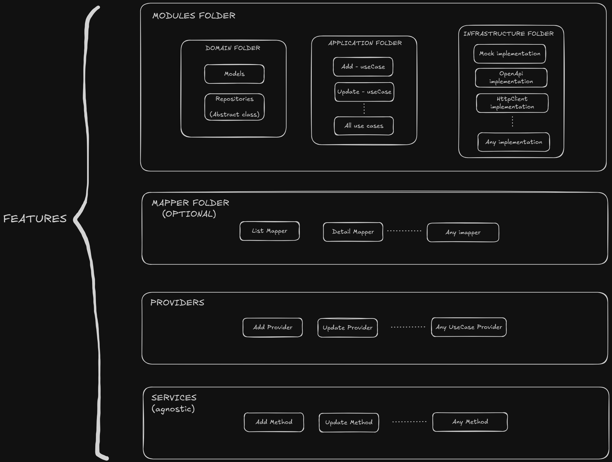

# # Hexagonal Architecture Applied to Front-End

This project demonstrates the implementation of Hexagonal Architecture principles in a FrontEnd application using Angular. Hexagonal Architecture, also known as Ports and Adapters, promotes a clean separation of concerns, making the application more maintainable, testable, and adaptable to changes.



## What is Hexagonal Architecture?

Hexagonal Architecture is a design pattern that emphasizes the separation of the core business logic (domain) from external concerns like user interfaces, databases, or APIs. It achieves this by defining clear boundaries and using interfaces (ports) to communicate between the core and external systems (adapters).

### Key Principles:
1. **Core Domain Logic**: The core of the application contains the business rules and logic. It is independent of any external systems.
2. **Ports**: Interfaces that define how the core interacts with the outside world.
3. **Adapters**: Implementations of the ports that connect the core to external systems like APIs, databases, or user interfaces.
4. **Dependency Inversion**: The core depends on abstractions (ports), not concrete implementations (adapters).

## Applying Hexagonal Architecture in FrontEnd

This project applies Hexagonal Architecture principles in the following way:

### 1. **Feature Separation**
   - The first step is to separate the application by features. Each feature is self-contained, and within each feature, we apply the principles of Hexagonal Architecture.
   - The feature app example is: "products"

### 2. **Domain Layer**
   - Located in `src/app/features/products/modules/domain/`.
   - Contains the core business logic, including models (`product.model.ts`) and the `ProductRepository` interface, where we will define the abstract methods that must be implemented in the model, such as `getProductList`, `getProductById`, etc.

### 3. **Application Layer**
   - Located in `src/app/features/products/modules/application/`.
   - Contains use cases like `get-product-list.usecase.ts` and `get-product-detail.usecase.ts`, which orchestrate the domain logic.

### 4. **Infrastructure Layer**
   - Located in `src/app/features/products/modules/infrastructure/`.
   - Contains implementations of the `ProductRepository` interface, such as:
     - `product-dummyjson-impl.repository.ts` for real API integration.
     - `product-mock-impl.repository.ts` for mock data during development or testing.

### 5. **Presentation Layer**
   - Located in `src/app/features/products/presentation/`.
   - Contains Angular components like `product.component.ts` that interact with the user interface.

### 6. **Dependency Injection**
   - Dependency injection is used to bind the `ProductRepository` interface to its implementation (`ProductDummyJsonImplRepository` or `ProductMockImplRepository`) in the `providers` array of the `ProductComponent`.

### 7. **Services Layer**
   - Located in `src/app/features/products/services/`.
   - The service implements the `ProductRepository` interface in an agnostic way, meaning it does not depend on any specific implementation. This ensures that if we change the implementation in the future, we only need to update the infrastructure layer without modifying the component or the service itself.

### 8. **How to Change Service Implementations in the Component**
   - To change the service implementation used in a component, update the `providers` array in the component's metadata. For example, in the `ProductComponent`, you can specify which implementation of the `ProductRepository` interface to use:
     ```typescript
     // filepath: src/app/features/products/presentation/product.component.ts
     @Component({
       selector: 'app-product',
       templateUrl: './product.component.html',
       styleUrls: ['./product.component.css'],
       providers: [
         { provide: ProductRepository, useClass: ProductDummyJsonImplRepository }
       ]
     })
     ```
   - This allows you to switch between different implementations (e.g., `ProductDummyJsonImplRepository` or `ProductMockImplRepository`) without modifying the service or the component logic.

## Advantages

- **Testability**: The core logic can be tested independently of the UI or external systems.
- **Flexibility**: Easily switch between different implementations (e.g., mock vs. real API) without changing the core logic.
- **Maintainability**: Clear separation of concerns makes the code easier to understand and maintain.
- **Scalability**: The architecture is adaptable to new requirements or technologies.

## Disadvantages

- **Complexity**: Implementing Hexagonal Architecture in a FrontEnd application can introduce additional complexity, especially for small or simple projects.
- **Learning Curve**: Developers unfamiliar with this architecture may require time to understand and apply its principles effectively.
- **Overhead**: The separation of layers and use of abstractions can lead to more boilerplate code, which may slow down initial development.
- **Performance**: In some cases, the additional layers of abstraction may slightly impact performance, though this is usually negligible in modern applications.

## Bonus: ConfigService and app.config.json

This project includes a `ConfigService` that reads configuration values from the `app.config.json` file located in the `assets` folder. This approach provides several advantages:

- **Centralized Configuration**: All application settings are stored in a single JSON file, making it easier to manage and update configurations.
- **Environment-Specific Configurations**: By modifying the `app.config.json` file during deployment, you can adapt the application to different environments (e.g., development, staging, production) without changing the source code.
- **Dynamic Updates**: Configuration changes can be made without requiring a rebuild of the application, as the JSON file is loaded at runtime.
- **Separation of Concerns**: Keeps configuration details separate from the application logic, improving maintainability.

### Example: app.config.json
```json
{
  "apiBaseUrl": "https://api.example.com",
  "featureToggle": {
    "enableFeatureX": true
  }
}
```

### Usage
The ConfigService can be used to load and access configuration values throughout the application. For example, you can load the configuration during the app initialization phase and access specific settings as needed.

### Deployment Advantage
By keeping the configuration in a JSON file, you can easily update environment-specific settings (e.g., API endpoints, feature toggles) during deployment without modifying or rebuilding the application. This is particularly useful in CI/CD pipelines or when deploying to multiple environments.


## How to Run the Project

### Development Server
To install dependencies, run:

```bash
npm install
```

To start the development server, run:
```bash
ng serve
```

Once the server is running, open your browser and navigate to `http://localhost:4200/`. The application will automatically reload whenever you modify any of the source files.
